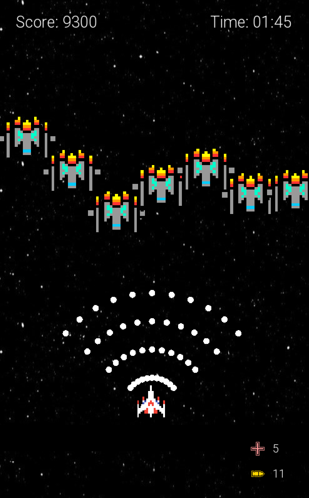

# Galactic Odyssey

Galactic Odyssey is a 2D scrolling spaceship game built using SFML and C++. In this game, you control a spaceship, dodge obstacles, and shoot enemies as you progress through space. The game features dynamic shooting mechanics, smooth input handling, and engaging gameplay.




## Installation

1. Clone the repository:
   ```bash
   git clone https://github.com/a-lothian/galactic-odyssey.git

2. Navigate to the project directory:
   ```bash
   cd galactic-odyssey
   ```

3. Compile and run the project:
   ```bash
   make run
   ```

## Requirements

- SFML 2.5 or later (Make sure SFML headers and libraries are installed and accessible on your system)
  
  ### Installing SFML
  - **Linux**: Install via your package manager (`sudo apt-get install libsfml-dev` on Ubuntu)
  - **macOS**: Install via Homebrew (`brew install sfml`)
  - **Windows**: Download from [SFML website](https://www.sfml-dev.org/download.php) and follow the setup instructions.

## License

This project is licensed under the Creative Commons Attribution-NonCommercial 4.0 International License. You may not use the material for commercial purposes. See the [LICENSE](LICENSE) file for details.


## Contributions

Contributions are welcome! If you'd like to contribute, please fork the repository and submit a pull request.